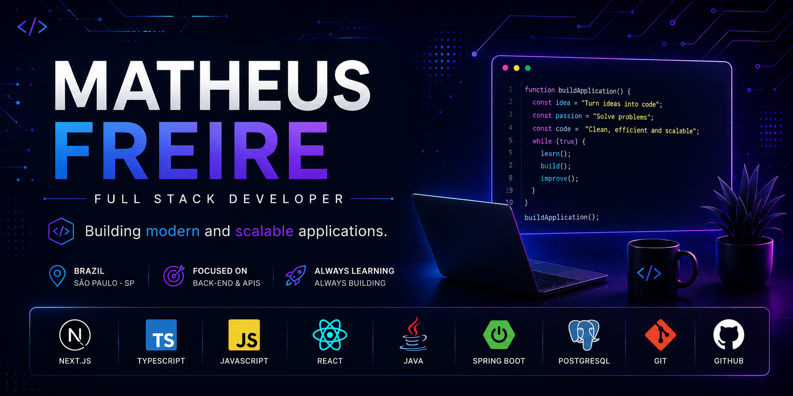
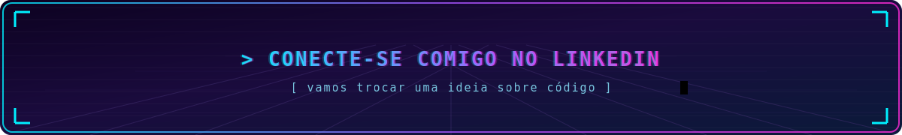

  

  

<h1 align="center">hey there 👋</h1>

  

 

## 🧑‍💻 Sobre mim

Sou apaixonado por tecnologia e estou construindo minha base para entrar na área como **Backend Developer**. Venho me dedicando aos estudos e colocando a mão na massa em projetos **Full Stack**, aprendendo o processo completo, do banco de dados à interface.

- 🎯 Focado em me tornar um **Desenvolvedor Backend**
- 🚀 Construindo projetos **Full Stack** para entender a aplicação como um todo
- 📚 Estudando todos os dias e evoluindo a cada projeto
- 💬 Fale comigo sobre programação, projetos ou oportunidades!

 

## 🛠️ Tecnologias

  
  
  
  
  
  
  

 

## 📊 Estatísticas do GitHub

  
  

  

 
